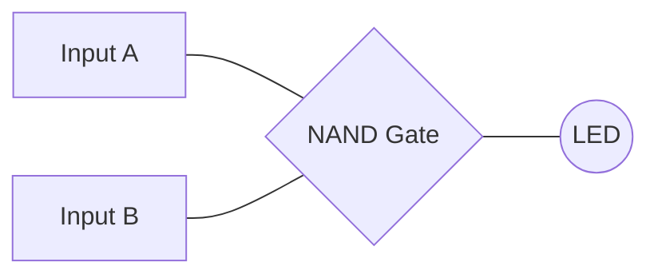
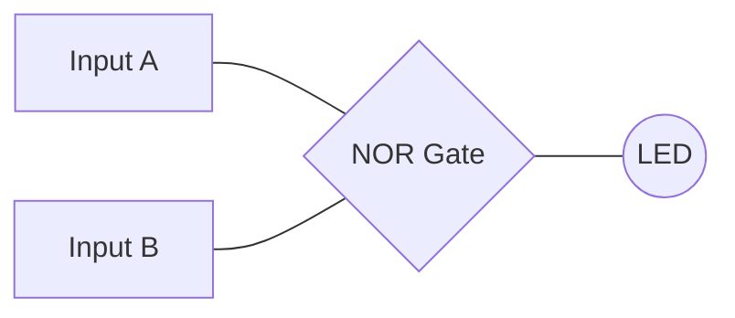
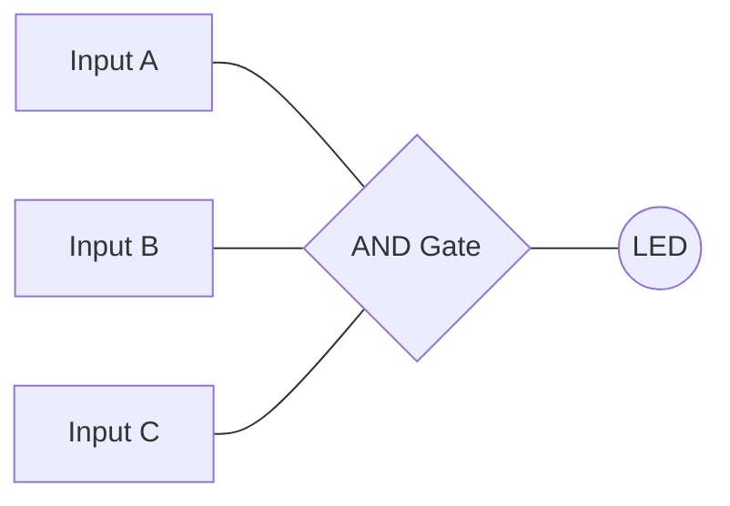
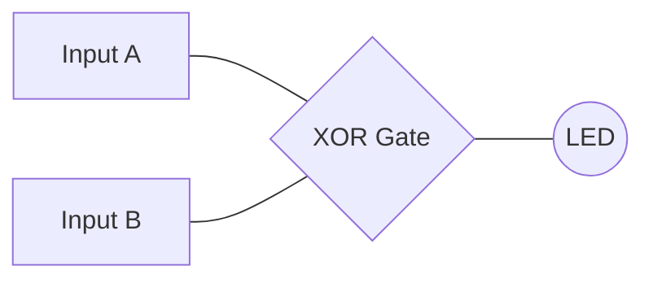
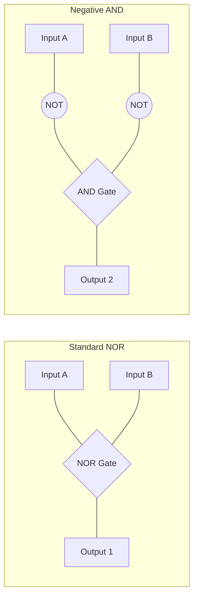
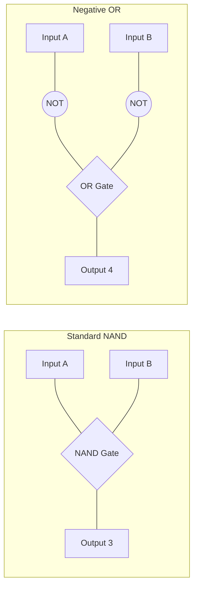
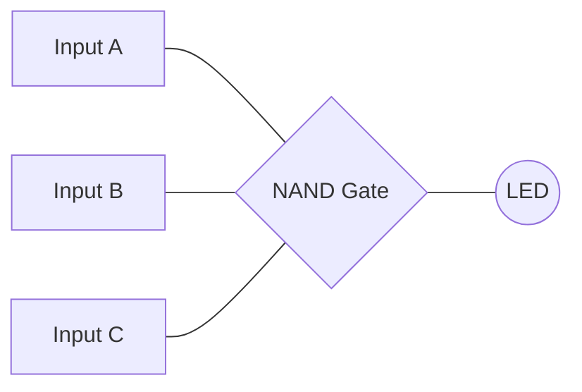

# Lab A2 - Report

## 1. Perform the study of the truth table of the following logic gates and verify the truth table of the gates experimentally.

### i. 2 input NAND gate

| A    | B    | A NAND B |
| :--- | :--- | :---     |
| 0    | 0    | 1        |
| 0    | 1    | 1        |
| 1    | 0    | 1        |
| 1    | 1    | 0        |

### ii. 2 input NOR gate

| A    | B    | A NOR B |
| :--- | :--- | :---    |
| 0    | 0    | 1       |
| 0    | 1    | 0       |
| 1    | 0    | 0       |
| 1    | 1    | 0       |

### iii. 3 input AND gate

| A    | B    | C    | A AND B AND C |
| :--- | :--- | :--- | :---          |
| 0    | 0    | 0    | 0             |
| 0    | 0    | 1    | 0             |
| 0    | 1    | 0    | 0             |
| 0    | 1    | 1    | 0             |
| 1    | 0    | 0    | 0             |
| 1    | 0    | 1    | 0             |
| 1    | 1    | 0    | 0             |
| 1    | 1    | 1    | 1             |

### iv. 2 input XOR gate 

| A    | B    | A XOR B |
| :--- | :--- | :---    |
| 0    | 0    | 0       |
| 0    | 1    | 1       |
| 1    | 0    | 1       |
| 1    | 1    | 0       |

## 2.
### i. Prove that NOR gate is equivalent to a negative AND gate by constructing a simple circuit using NOT and AND.

| A    | B    | A NOR B | A' AND B' |
| :--- | :--- | :---    | :---      |
| 0    | 0    | 1       | 1         |
| 0    | 1    | 0       | 0         |
| 1    | 0    | 0       | 0         |
| 1    | 1    | 0       | 0         |

### ii. Prove that NAND gate is equivalent to a negative OR gate by constructing a simple circuit using NOT and OR gates and verify the truth table experimentally.

| A    | B    | A NAND B | $A'$ OR $B'$ |
| :--- | :--- | :---     | :---         |
| 0    | 0    | 1        | 1            |
| 0    | 1    | 1        | 1            |
| 1    | 0    | 1        | 1            |
| 1    | 1    | 0        | 0            |

## 3. Perform NOR operation on decimal inputs 10, 13, and 7. Convert the decimal input to the 4 bits binary form before performing the operations.

* **10**: 1010
* **13**: 1101 
* **7**: 0111 
* **NOR Result**: 0000

## 4. Perform NAND operation on decimal inputs 6, 9, and 11. Convert the decimal input to the 4 bits binary form before performing the operations.

* **6**: 0110
* **9**: 1001 
* **11**: 1011 
* **NAND Result**: 1111

## 5. Based on the input and output sequences given below, identify the corresponding logic operation performed on the inputs.

### i. First Sequence
* **Input A**: 0 1 0 1 
* **Input B**: 1 0 1 1
* **Input C**: 0 1 1 1 
* **Output**: 1 1 1 0
* **SOP**: $ABC' + A'BC + A'B'C$
* **POS**: $A' + B' + C'$
* **Logic Operation**: A NAND B NAND C 

### ii. Second Sequence
* **Input A**: 0 0 1 1
* **Input B**: 0 1 1 0 
* **Output**: 0 0 1 1
* **SOP**: $A'B + AB'$
* **POS**: $(A + B)(A' + B')$ 
* **Logic Operation**: A XOR B

