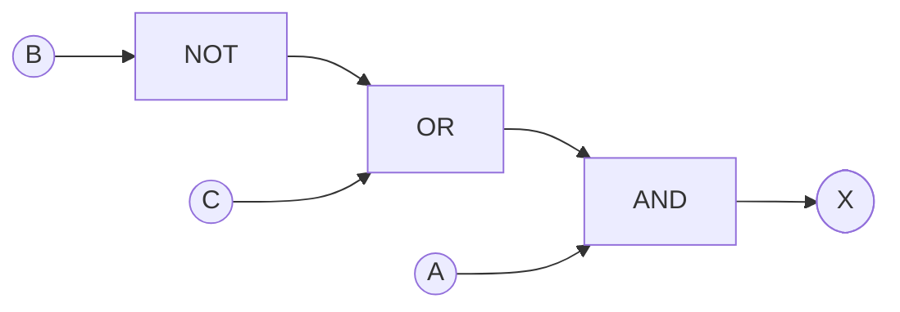
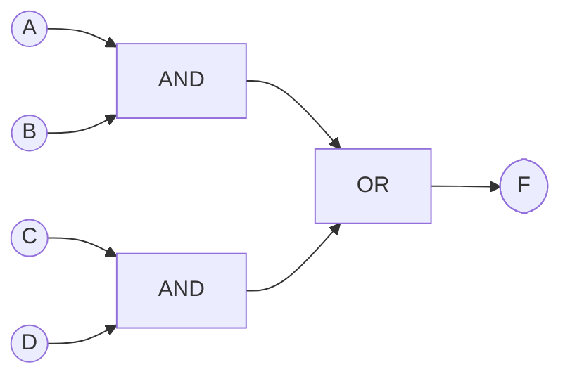
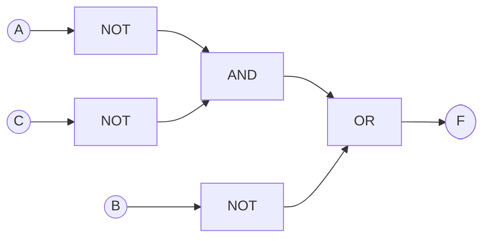
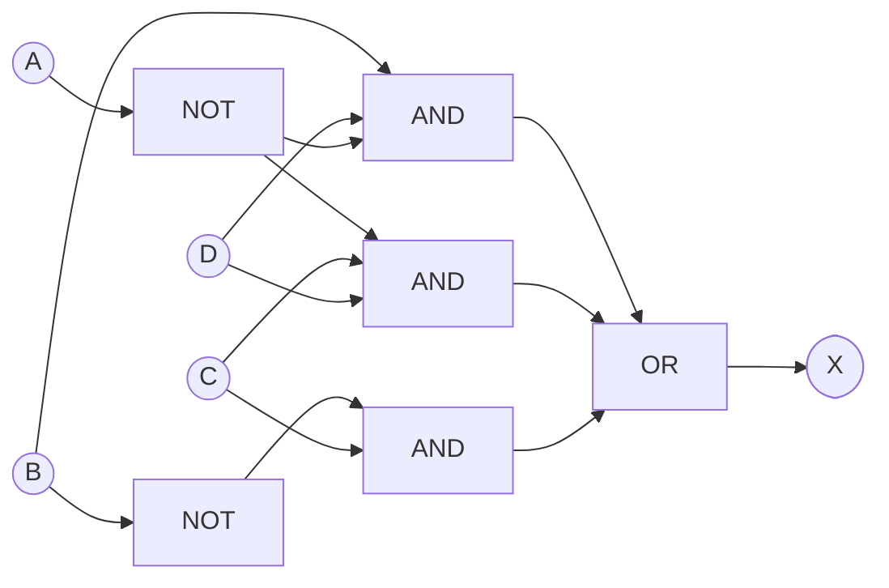
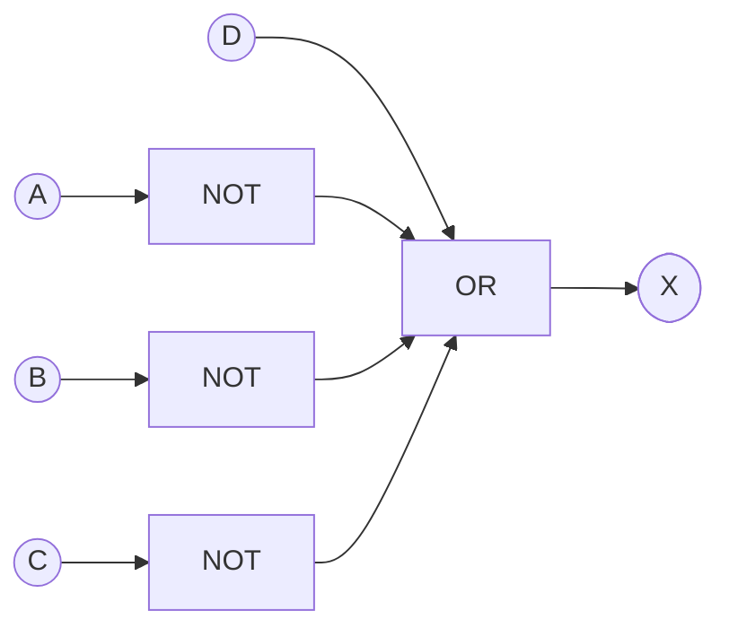

# Lab A3 Report 

## 1.

### i. Identify the Boolean expression for the given logic diagram and obtain the truth table.

$$X = A(\bar{A}\bar{C})'\bar{B} + ABC$$

**Full Truth Table:**

| A | B | C | $\bar{A}\bar{C}$ | $(\bar{A}\bar{C})'$ | $A(\bar{A}\bar{C})'\bar{B}$ | $ABC$ | X |
| :--- | :--- | :--- | :--- | :--- | :--- | :--- | :--- |
| 0 | 0 | 0 | 1 | 0 | 0 | 0 | **0** |
| 0 | 0 | 1 | 0 | 1 | 0 | 0 | **0** |
| 0 | 1 | 0 | 1 | 0 | 0 | 0 | **0** |
| 0 | 1 | 1 | 0 | 1 | 0 | 0 | **0** |
| 1 | 0 | 0 | 0 | 1 | 1 | 0 | **1** |
| 1 | 0 | 1 | 0 | 1 | 1 | 0 | **1** |
| 1 | 1 | 0 | 0 | 1 | 0 | 0 | **0** |
| 1 | 1 | 1 | 0 | 1 | 0 | 1 | **1** |

### ii. Simplify the identified expression using the Boolean rules, laws and theorems. Draw the truth table for the simplified Boolean expression. Construct the circuit only for the simplified expression and verify the truth table experimentally.
$$X = A(\bar{A}\bar{C})'\bar{B} + ABC$$

$$X = A[(\bar{A})' + (\bar{C})']\bar{B} + ABC$$

$$X = A(A + C)\bar{B} + ABC$$

$$X = (A + AC)\bar{B} + ABC$$

$$X = A\bar{B} + ABC$$

$$X = A(\bar{B} + BC)$$

$$X = A[(B + \bar{B})(\bar{B} + C)]$$

$$X = A(\bar{B} + C)$$

**Simplified Truth Table:**

| A | B | C | $\bar{B} + C$ | X |
| :--- | :--- | :--- | :--- | :--- |
| 0 | 0 | 0 | 1 | **0** |
| 0 | 0 | 1 | 1 | **0** |
| 0 | 1 | 0 | 0 | **0** |
| 0 | 1 | 1 | 1 | **0** |
| 1 | 0 | 0 | 1 | **1** |
| 1 | 0 | 1 | 1 | **1** |
| 1 | 1 | 0 | 0 | **0** |
| 1 | 1 | 1 | 1 | **1** |

**Simplified Circuit Diagram:**

## 2.

### i.Obtain sum of products expression for the given NAND network and draw the truth table.
$$F = AB + CD$$

**Truth Table:**

| A | B | C | D | AB CD | F |
| :--- | :--- | :--- | :--- | :--- | :--- |
| 0 | 0 | 0 | 0 | 0 0 0 0 | 0 |
| 0 | 0 | 1 | 0 | 0 0 | 0 |
| 0 | 0 | 1 | 1 | 0 1 | 1 |
| 0 | 1 | 0 | 0 | 0 0 | 0 |
| 0 | 1 | 0 | 1 | 0 0 | 0 |
| 0 | 1 | 1 | 0 | 0 0 | 0 |
| 0 | 1 | 1 | 1 | 0 1 | 0 |
| 1 | 0 | 0 | 0 | 0 0 | 0 |
| 1 | 0 | 0 | 1 | 0 0 | 0 |
| 1 | 0 | 1 | 0 | 0 0 | 0 |
| 1 | 0 | 1 | 1 | 1 0 | 1 |
| 1 | 1 | 0 | 0 | 0 1 | 1 |
| 1 | 1 | 0 | 1 | 1 0 | 1 |
| 1 | 1 | 1 | 0 | 1 0 | 1 |
| 1 | 1 | 1 | 1 | 1 1 | 1 |

### ii. Lonstruct the logic diagram only by using AND/OR/NOT gates and verify the truth table experimentally

## 3.

### i. Identify the Boolean expression for the given logic diagram and obtain the truth table.
$$F = A\bar{B} + \bar{A}\bar{B} + [B(B + \bar{C})]' + \bar{A}\bar{C}$$

**Truth Table:**
 
| A | B | C | $[B(B+C^{\prime})]^{\prime}$ $AB^{\prime}$ $A^{\prime}B^{\prime}$ $A^{\prime}C^{\prime}$ | F |
| :--- | :--- | :--- | :--- | :--- |
| 0 | 0 | 0 | 0 1 1 1 | 1 |
| 0 | 0 | 1 | 0 0 1 1 | 1 |
| 0 | 1 | 0 | 0 0 1 0 | 1 |
| 0 | 1 | 1 | 0 0 0 0 | 0 |
| 1 | 0 | 0 | 0 1 0 1 | 1 |
| 1 | 0 | 1 | 1 0 1 0 | 1 |
| 1 | 1 | 0 | 0 0 0 0 | 0 |
| 1 | 1 | 1 | 0 0 0 0 | 0 |

### ii. Simplify the identified expression using the Boolean rules, laws and theorems. Draw the truth table for the simplified Boolean expression. Construct the circuit for the simplified expression.
$$F = (A + \bar{A})\bar{B} + (B + \bar{C})' + \bar{A}\bar{C}$$

$$F = \bar{B} + \bar{B}C + \bar{A}\bar{C}$$

$$F = \bar{B} + \bar{A}\bar{C}$$

**Simplified Circuit Diagram:**

**Simplified Truth Table:**

| A | B | C | A'C' | F |
| :--- | :--- | :--- | :--- | :--- |
| 0 | 0 | 0 | 1 | 1 |
| 0 | 0 | 1 | 0 | 1 |
| 0 | 1 | 0 | 1 | 1 |
| 0 | 1 | 1 | 0 | 0 |
| 1 | 0 | 0 | 0 | 1 |
| 1 | 0 | 1 | 0 | 1 |
| 1 | 1 | 0 | 0 | 0 |
| 1 | 1 | 1 | 0 | 0 |

## 4.

### i. Obtain sum of products expression for the given NAND network and draw the truth table.
$$X = [(\{\bar{B}\bar{C}\}'\bar{A}D)'(\bar{B}C)']'$$

**Truth Table:**

| A | B | C | D | A'BD A'CD B'C | X |
| :--- | :--- | :--- | :--- | :--- | :--- |
| 0 | 0 | 0 | 0 | 0 0 0 | 0 |
| 0 | 0 | 0 | 1 | 0 0 0 | 0 |
| 0 | 0 | 1 | 0 | 0 0 1 | 1 |
| 0 | 0 | 1 | 1 | 0 1 1 | 1 |
| 0 | 1 | 0 | 0 | 0 0 0 | 0 |
| 0 | 1 | 0 | 1 | 0 0 1 | 1 |
| 0 | 1 | 1 | 0 | 0 0 0 | 0 |
| 0 | 1 | 1 | 1 | 1 1 0 | 1 |
| 1 | 0 | 0 | 0 | 0 0 0 | 0 |
| 1 | 0 | 0 | 1 | 0 0 0 | 0 |
| 1 | 0 | 1 | 0 | 0 0 1 | 1 |
| 1 | 0 | 1 | 1 | 0 0 1 | 1 |
| 1 | 1 | 0 | 0 | 0 0 0 | 0 |
| 1 | 1 | 0 | 1 | 0 0 0 | 0 |
| 1 | 1 | 1 | 0 | 0 0 0 | 0 |
| 1 | 1 | 1 | 1 | 0 0 0 | 0 |

### ii. Construct the logic diagram using AND/OR/NOT gates.

**Simplified Expression:**
$$X = \bar{A}BD + \bar{A}CD + \bar{B}C$$

**Simplified Circuit Diagram:**

### 5.

### i. Identify the Boolean expression for the given logic diagram and obtain the truth table.
$$X = \bar{A} + \bar{B} + \bar{C} + D$$

**Simplified Truth Table:**
| A | B | C | D | $AB^{\prime}C$ | $AB^{\prime}$ | $B^{\prime}C$ | $B^{\prime}C^{\prime}D^{\prime}$ | $(ACD^{\prime})^{\prime}$ | X |
| :--- | :--- | :--- | :--- | :--- | :--- | :--- | :--- | :--- | :--- |
| 0 | 0 | 0 | 0 | 0 | 0 | 0 | 1 | 1 | 1 |
| 0 | 0 | 0 | 1 | 0 | 0 | 0 | 0 | 1 | 1 |
| 0 | 0 | 1 | 0 | 0 | 0 | 1 | 0 | 1 | 1 |
| 0 | 0 | 1 | 1 | 0 | 0 | 1 | 0 | 1 | 1 |
| 0 | 1 | 0 | 0 | 0 | 0 | 0 | 0 | 1 | 1 |
| 0 | 1 | 0 | 1 | 0 | 0 | 0 | 0 | 1 | 1 |
| 0 | 1 | 1 | 0 | 0 | 0 | 0 | 0 | 1 | 1 |
| 0 | 1 | 1 | 1 | 0 | 0 | 0 | 0 | 1 | 1 |
| 1 | 0 | 0 | 0 | 0 | 1 | 0 | 1 | 1 | 1 |
| 1 | 0 | 0 | 1 | 0 | 1 | 0 | 0 | 1 | 1 |
| 1 | 0 | 1 | 0 | 1 | 1 | 1 | 0 | 0 | 1 |
| 1 | 0 | 1 | 1 | 1 | 1 | 1 | 0 | 1 | 1 |
| 1 | 1 | 0 | 0 | 0 | 0 | 0 | 0 | 1 | 1 |
| 1 | 1 | 0 | 1 | 0 | 0 | 0 | 0 | 1 | 1 |
| 1 | 1 | 1 | 0 | 0 | 0 | 0 | 0 | 0 | 0 |
| 1 | 1 | 1 | 1 | 0 | 0 | 0 | 0 | 1 | 1 |

### ii. Simplify the identified expression using the Boolean rules, laws and theorems. Draw the truth table for the simplified Boolean expression. Construct the circuit for the simplified expression.

**Simplified Circuit Diagram:**

**Simplified Truth Table:**

| A B C | D | X |
| :--- | :--- | :--- |
| 0 0 0 | 0 | 1 |
| 0 0 0 | 1 | 1 |
| 0 0 1 | 0 | 1 |
| 0 1 0 | 1 | 1 |
| 0 0 1 | 0 | 1 |
| 0 0 1 | 1 | 1 |
| 0 1 1 | 0 | 1 |
| 0 1 1 | 1 | 1 |
| 1 0 0 | 0 | 1 |
| 1 0 0 | 1 | 1 |
| 0 1 1 | 0 | 1 |
| 0 1 1 | 1 | 1 |
| 1 0 1 | 0 | 1 |
| 1 0 1 | 1 | 1 |
| 1 1 1 | 0 | 0 |
| 1 1 1 | 1 | 1 |
