# Lab A5 - Report

## 1. Design a 3 input priority encoder circuit. The inputs are a3a2a1, with a3 having the lowest priority and a1 the highest. The outputs are y2y1, indicating the encoded highest-priority active input, and v, the valid output which indicates that at least one input is active. (Note: Priority input a3 is encoded as 11, a2 as 10 and a1 as 01). Perform the following:

### i. Construct the truth table.

| A3 | A2 | A1 | Y2 | Y1 | V |
| :--- | :--- | :--- | :--- | :--- | :--- |
| 0 | 0 | 0 | X | X | 0 |
| 1 | 0 | 0 | 1 | 1 | 1 |
| X | 1 | 0 | 1 | 0 | 1 |
| X | X | 1 | 0 | 1 | 1 |

### ii. Simplify the Boolean expressions for y2, y1 , and v using Karnaugh map techniques.

### iii. Draw the logic diagram with necessary basic logic gates.

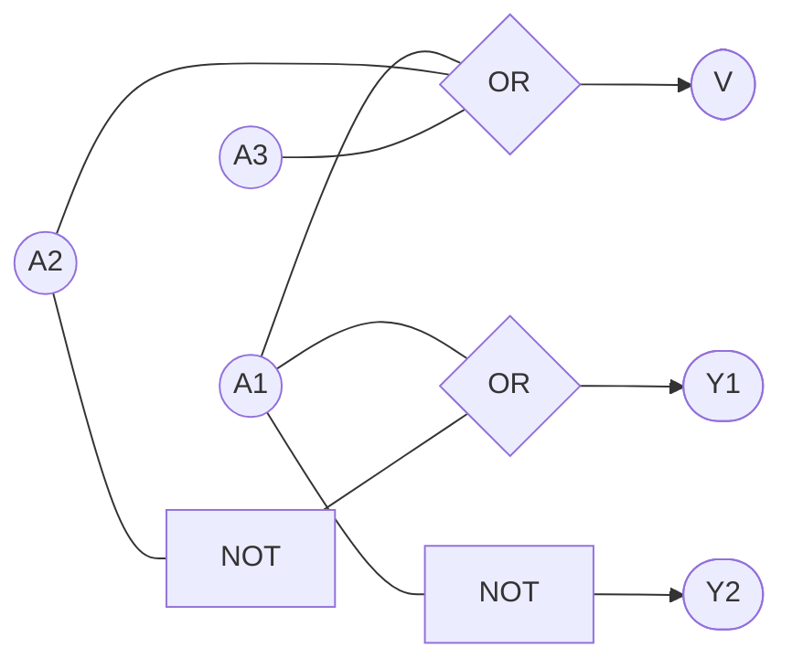

## 2. Design and construct a 3 to 8 decoder circuit using 2-line-to-4-line decoder and also other logic gates needed. Perform the following:

### i. Form the truth table for higher order decoder (3 to 8 decoder)

| E | A | B | D0 | D1 | D2 | D3 | D4 | D5 | D6 | D7 |
|:-:|:-:|:-:|:-:|:-:|:-:|:-:|:-:|:-:|:-:|:-:|
| 0 | 0 | 0 | 1 | 0 | 0 | 0 | 0 | 0 | 0 | 0 |
| 0 | 0 | 1 | 0 | 1 | 0 | 0 | 0 | 0 | 0 | 0 |
| 0 | 1 | 0 | 0 | 0 | 1 | 0 | 0 | 0 | 0 | 0 |
| 0 | 1 | 1 | 0 | 0 | 0 | 1 | 0 | 0 | 0 | 0 |
| 1 | 0 | 0 | 0 | 0 | 0 | 0 | 1 | 0 | 0 | 0 |
| 1 | 0 | 1 | 0 | 0 | 0 | 0 | 0 | 1 | 0 | 0 |
| 1 | 1 | 0 | 0 | 0 | 0 | 0 | 0 | 0 | 1 | 0 |
| 1 | 1 | 1 | 0 | 0 | 0 | 0 | 0 | 0 | 0 | 1 |

### ii. Design higher order decoder using the given lower order decoder.

| E | A | B | D1-0 | D1-1 | D1-2 | D1-3 | D2-0 | D2-1 | D2-2 | D2-3 |
|:-:|:-:|:-:|:-:|:-:|:-:|:-:|:-:|:-:|:-:|:-:|
| 0 | 0 | 0 | 1 | 0 | 0 | 0 | 0 | 0 | 0 | 0 |
| 0 | 0 | 1 | 0 | 1 | 0 | 0 | 0 | 0 | 0 | 0 |
| 0 | 1 | 0 | 0 | 0 | 1 | 0 | 0 | 0 | 0 | 0 |
| 0 | 1 | 1 | 0 | 0 | 0 | 1 | 0 | 0 | 0 | 0 |
| 1 | 0 | 0 | 0 | 0 | 0 | 0 | 1 | 0 | 0 | 0 |
| 1 | 0 | 1 | 0 | 0 | 0 | 0 | 0 | 1 | 0 | 0 |
| 1 | 1 | 0 | 0 | 0 | 0 | 0 | 0 | 0 | 1 | 0 |
| 1 | 1 | 1 | 0 | 0 | 0 | 0 | 0 | 0 | 0 | 1 |

### iii. Draw the logic diagram for higher order decoder using two lower order decoders

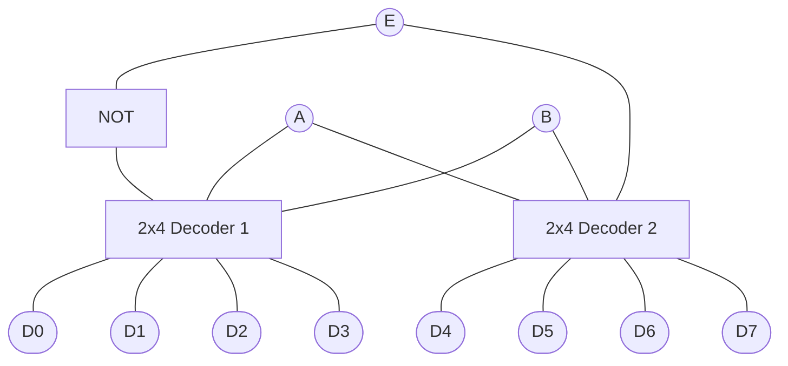

## 3. Design a full subtractor circuit using

### i. Two half subtractors.

|   A   |   B   |   Bout   |   D   |
|-------|-------|----------|-------|
|   0   |   0   |   0      |   0   |
|   0   |   1   |   1      |   1   |
|   1   |   0   |   0      |   1   |
|     1 |   1   |   0      |     0 |

**D =** A ⊕ B

**Bout =** A’B

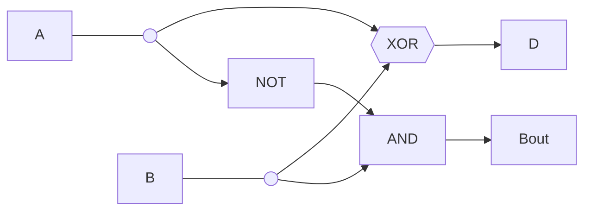

|   A   |   B   |   C   |   Bout   |   D   |
|-------|-------|-------|----------|-------|
|   0   |   0   |   0   |   0      |   0   |
|   0   |   0   |   1   |   1      |   1   |
|   0   |   1   |   0   |   1      |   1   |
|   0   |   1   |   1   |   1      |   0   |
|   1   |   0   |   0   |   0      |   1   |
|   1   |   0   |   1   |   0      |   0   |
|   1   |   1   |   0   |   0      |   0   |
|   1   |     1 | 1     |   1      |     1 |

**D =** A’B’C + A’BC’ + AB’C' + ABC = C(A’B'+AB) + C’(A’B+AB’) = C(AB’+A’B)' + C’(A’B+AB’) = C ⊕ A ⊕ B

**Bout =** A’B’C + A’BC’ + A’BC + ABC = C(A’B’ + AB) + A’B(C + C’) = C(A ⊕ B)’ + A’B

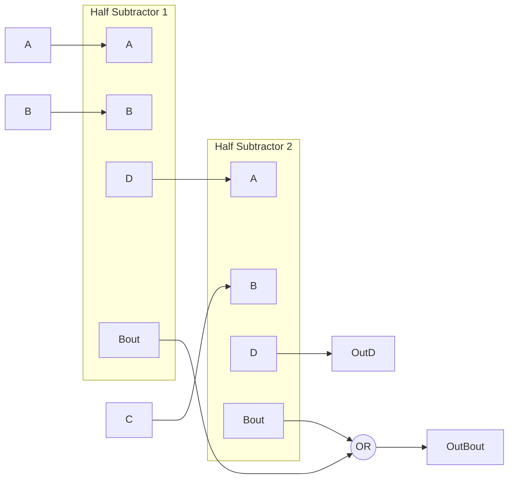

### ii. Using only NAND gates.

**D =** [A’B’C + A’BC’ + AB’C' + ABC]’’ = [(A’B’C)’(A’BC’)’(AB’C’)’(ABC)’]’

**Bout =** [A’B’C + A’BC’ + A’BC + ABC]’’ = [(A’B’C)’(A’BC’)’(A’BC)’(ABC)’]’

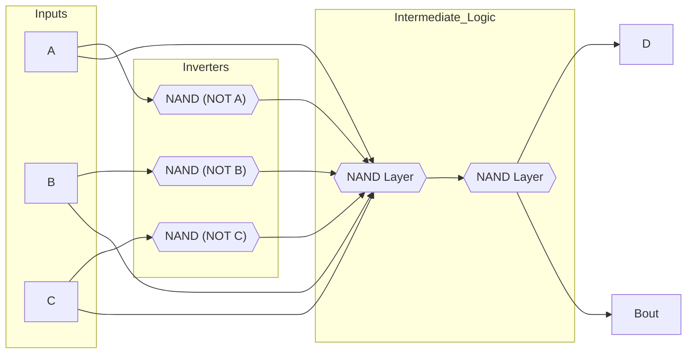

### iii. Using only NOR gates.

**D =** [(A+B+C)(A+B’+C’)(A’+B+C’)(A’+B’+C)]’’ = [(A+B+C)’ + (A+B’+C’)’ + (A’+B+C’)’ + (A’+B’+C)’]’

**Bout =** [(A+B+C)(A’+B+C)(A’+B+C’)(A’+B’+C)]’’ = [(A+B+C)’ + (A’+B+C)’ + (A’+B+C’)’ + (A’+B’+C)’]’

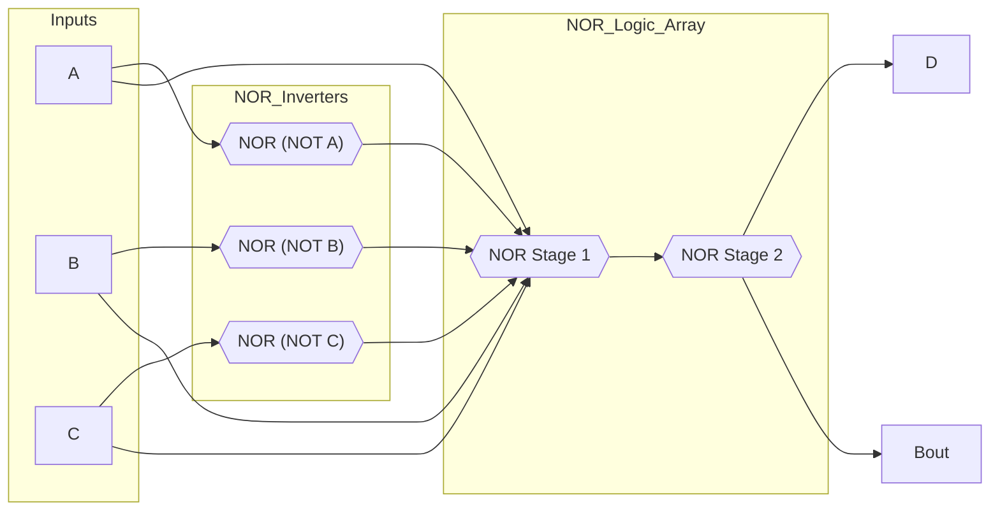

## 4.  Implement the following Boolean expression F(W, X, Y, Z) = ∑m (1, 2, 4, 6, 7, 9, 11, 14, 15)

| W | X | Y | Z | F16 | F8 |
|:-:|:-:|:-:|:-:|:-:|:-:|
| 0 | 0 | 0 | 0 | 0 | **Z** |
| 0 | 0 | 0 | 1 | 1 | |
| 0 | 0 | 1 | 0 | 1 | **Z'** |
| 0 | 0 | 1 | 1 | 0 | |
| 0 | 1 | 0 | 0 | 1 | **Z'** |
| 0 | 1 | 0 | 1 | 0 | |
| 0 | 1 | 1 | 0 | 1 | **1** |
| 0 | 1 | 1 | 1 | 1 | |
| 1 | 0 | 0 | 0 | 0 | **Z** |
| 1 | 0 | 0 | 1 | 1 | |
| 1 | 0 | 1 | 0 | 0 | **Z** |
| 1 | 0 | 1 | 1 | 1 | |
| 1 | 1 | 0 | 0 | 0 | **0** |
| 1 | 1 | 0 | 1 | 0 | |
| 1 | 1 | 1 | 0 | 1 | **1** |
| 1 | 1 | 1 | 1 | 1 | |

### i. Using 8×1 MUX and the needed logic gates

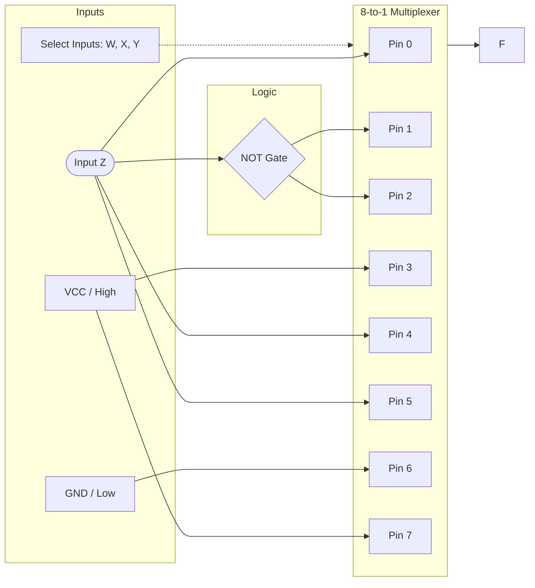

### ii. Using 16×1 MUX and the needed logic gates.

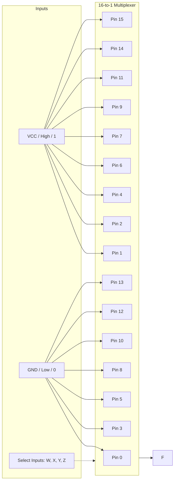

### iii. Using a suitable decoder and an OR gate.

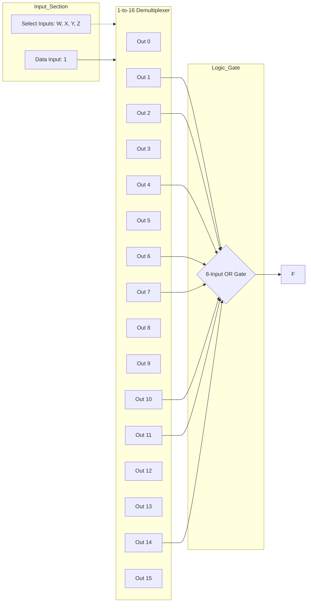

## 5. Design code converter circuits for the following problems: (For the above design problems, construct the truth table, simplify the Boolean expressions using K-map/Boolean Algebra techniques and draw the logic diagram)

### i. 3-bit Gray-to-binary code converter

|   G2   |   G1   |   G0   |   B2   |   B1   |   B0  |
|--------|--------|--------|--------|--------|-------|
|   0    |   0    |   0    |   0    |   0    |   0   |
|   0    |   0    |   1    |   0    |   0    |   1   |
|   0    |   1    |   0    |   0    |   1    |   1   |
|   0    |   1    |   1    |   0    |   1    |   0   |
|   1    |   0    |   0    |   1    |   1    |   1   |
|   1    |   0    |   1    |   1    |   1    |   0   |
|   1    |   1    |   0    |   1    |   0    |   0   |
|   1    |   1    |   1    |   1    |   0    |   1   |

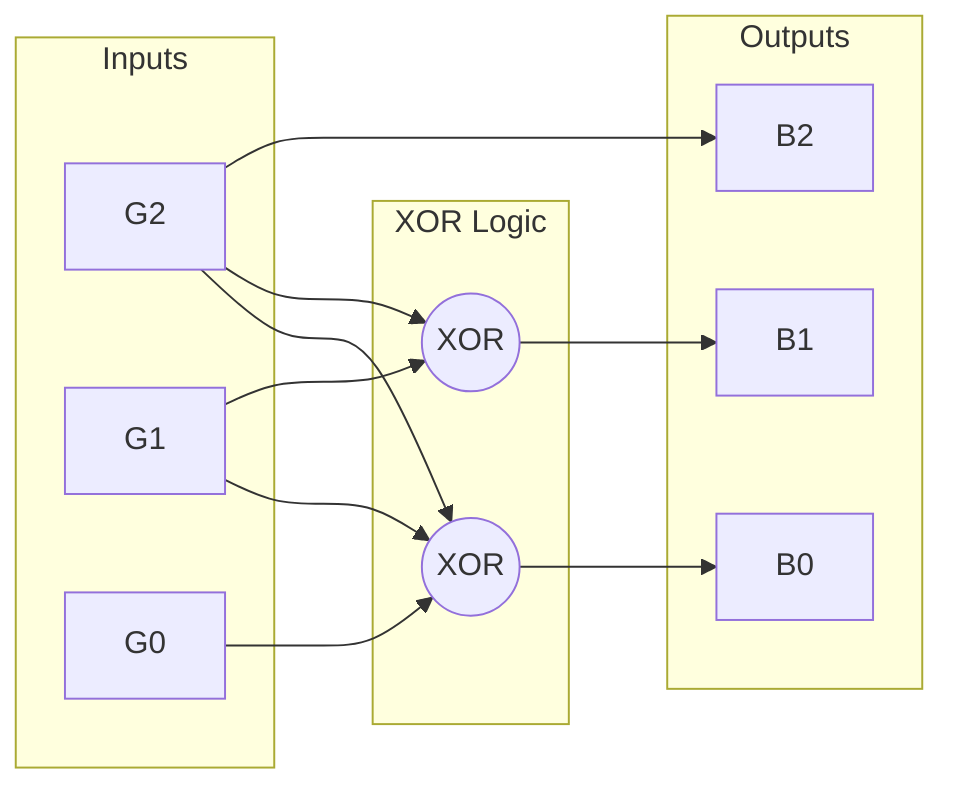

### ii. 3-bit Binary-to-Gray code converter.

|   B2   |   B1   |   B0   |   G2   |   G1   |   G0  |
|--------|--------|--------|--------|--------|-------|
|   0    |   0    |   0    |   0    |   0    |   0   |
|   0    |   0    |   1    |   0    |   0    |   1   |
|   0    |   1    |   0    |   0    |   1    |   1   |
|   0    |   1    |   1    |   0    |   1    |   0   |
|   1    |   0    |   0    |   1    |   1    |   0   |
|   1    |   0    |   1    |   1    |   1    |   1   |
|   1    |   1    |   0    |   1    |   0    |   1   |
|   1    |   1    |   1    |   1    |   0    |   0   |

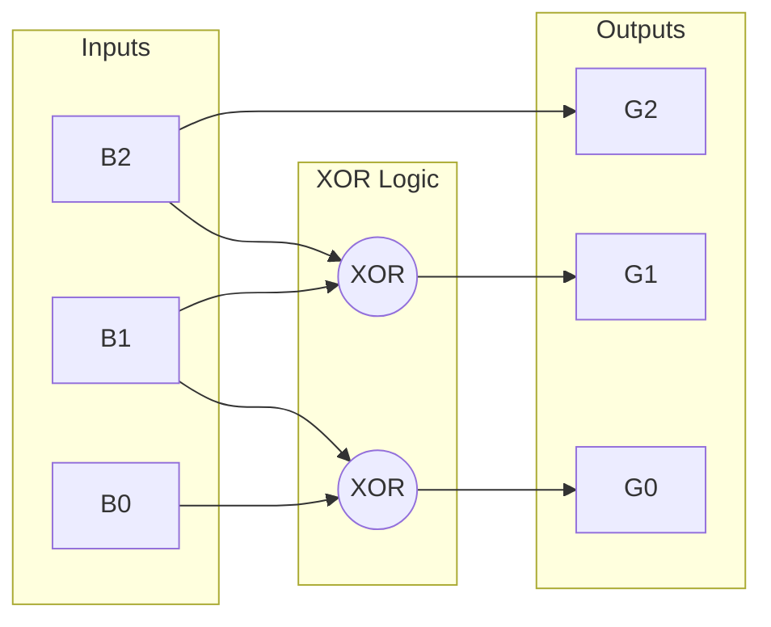

### iii. (8 4 -2 -1) BCD code to (Excess 3) BCD code converter.

|       |   A   |   B   |   C   |   D   |        |   X3   |   X2   |   X1   |   X0  |
|-------|-------|-------|-------|-------|--------|--------|--------|--------|-------|
|   0   |   0   |   0   |   0   |   0   |   3    |   0    |   0    |   1    |   1   |
|   1   |   0   |   1   |   1   |   1   |   4    |   0    |   1    |   0    |   0   |
|   2   |   0   |   1   |   1   |   0   |   5    |   0    |   1    |   0    |   1   |
|   3   |   0   |   1   |   0   |   1   |   6    |   0    |   1    |   1    |   0   |
|   4   |   0   |   1   |   0   |   0   |   7    |   0    |   1    |   1    |   1   |
|   5   |   1   |   0   |   1   |   1   |   8    |   1    |   0    |   0    |   0   |
|   6   |   1   |   0   |   1   |   0   |   9    |   1    |   0    |   0    |   1   |
|   7   |   1   |   0   |   0   |   1   |   10   |   1    |   0    |   1    |   0   |
|   8   |   1   |   0   |   0   |   0   |   11   |   1    |   0    |   1    |   1   |
|   9   |   1   |   1   |   1   |   1   |   12   |   1    |   1    |   0    |   0   |

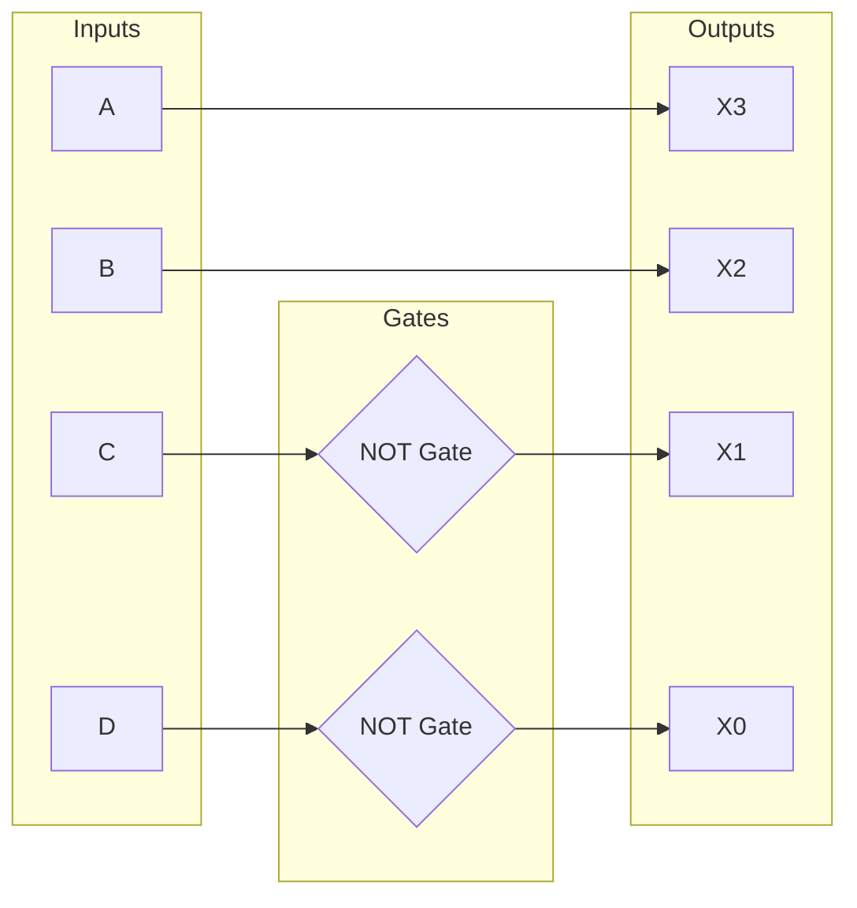
