# Lab 4 - Report

## 1. Design a combinational logic circuit for 3-input minority circuit. Assume that a minority circuit is one which produces a HIGH (1) when two or more inputs are LOW (0).

### i. Construct the truth table.

|   A   |   B   |   C   |   X   |   Product   |   Sum       |
|-------|-------|-------|-------|-------------|-------------|
|   0   |   0   |   0   |   1   |   A’B’C’    |             |
|   0   |   0   |   1   |   1   |   A’B’C     |             |
|   0   |   1   |   0   |   1   |   A’BC’     |             |
|   0   |   1   |   1   |   0   |             |   A+B’+C’   |
|   1   |   0   |   0   |   1   |   AB’C’     |             |
|   1   |   0   |   1   |   0   |             |   A’+B+C’   |
|   1   |   1   |   0   |   0   |             |   A’+B’+C   |
|   1   |   1   |   1   |   0   |             |   A’+B’+C'  |

### ii. Simplify the Boolean expression into product-of-sums (POS) form and sum-of-products (SOP) form using Boolean Algebra Techniques / Karnaugh map.

**SOP:** A’B’ + B’C’ + A’C’

**POS:** (A’+C’)(B’+C’)(A’+B')

### iii. Construct the logic diagram using OR-AND gate network and verify the circuit experimentally.

**SOP:**
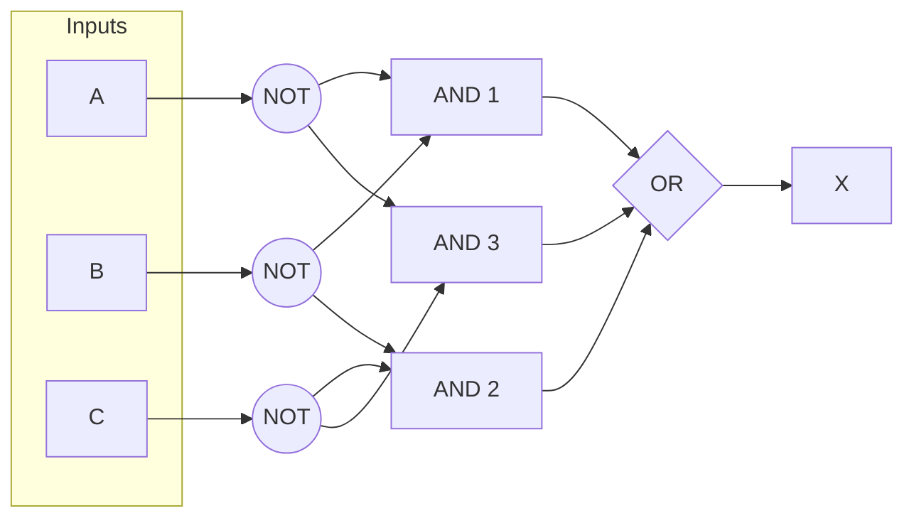

**POS:**
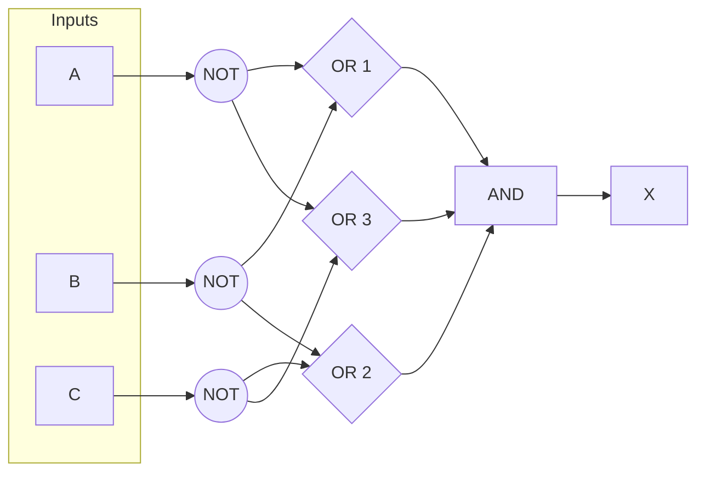

### iv. Construct the logic diagram using only NAND gates and verify the circuit experimentally.

**SOP:** A’B’ + B’C’ + A’C’ = [A’B’ + B’C’ + A’C’]’’ = [(A’B’)’(B’C’)’(A’C’)']’

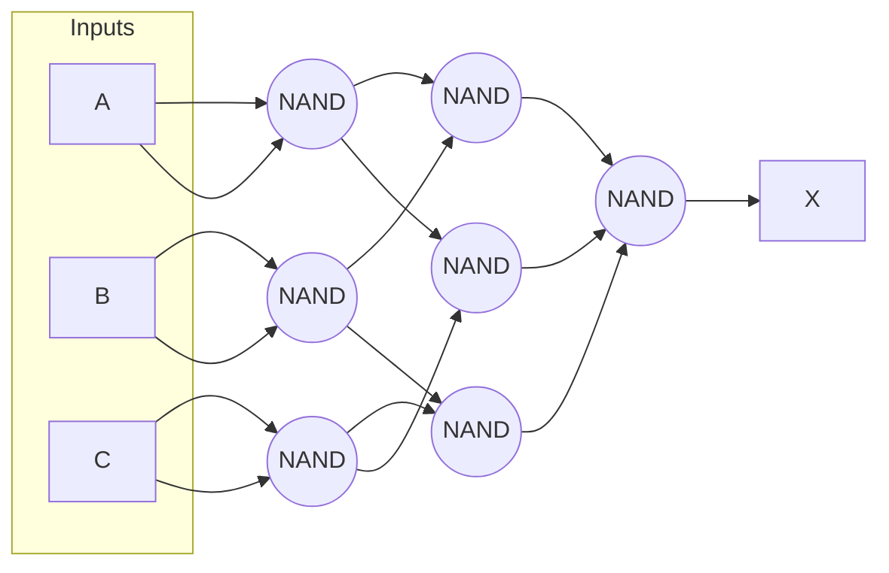

**POS:** (A’+C’)(B’+C’)(A’B') = [(A’+C’)(B’+C’)(A’B’)]’’ = [(B’+C’)’+(A’+B’)’+(A’+C’)’]’ = [BC+AB+AC]’ = (BC)’(AB)’(AC)’ = [(BC)’(AB)’(AC)’]’’

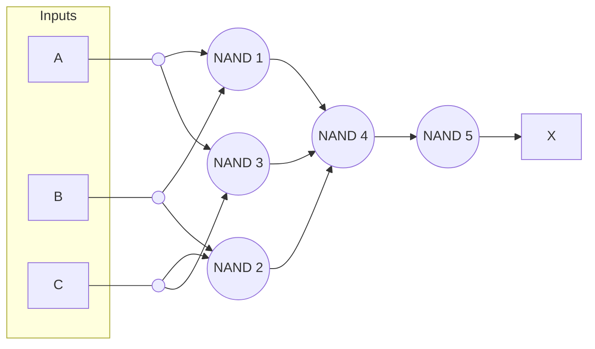

## 2. Design a combinational logic circuit for 4-input majority circuit. A majority circuit is one which produces a HIGH (1) output when three or more inputs are HIGH (1).

### i. Construct the truth table and simplify the Boolean expression into SOP and POS forms using K-map.

|   A   |   B   |   C   |   D   |   X   |   Product   |   Sum        |
|-------|-------|-------|-------|-------|-------------|--------------|
|   0   |   0   |   0   |   0   |   0   |             |   A+B+C+D    |
|   0   |   0   |   0   |   1   |   0   |             |   A+B+C+D’   |
|   0   |   0   |   1   |   0   |   0   |             |   A+B+C’+D   |
|   0   |   0   |   1   |   1   |   0   |             |   A+B+C’+D’  |
|   0   |   1   |   0   |   0   |   0   |             |   A+B’+C+D   |
|   0   |   1   |   0   |   1   |   0   |             |   A+B’+C+D’  |
|   0   |   1   |   1   |   0   |   0   |             |   A+B’+C’+D  |
|   0   |   1   |   1   |   1   |   1   |   A’BCD     |              |
|   1   |   0   |   0   |   0   |   0   |             |   A’+B+C+D   |
| 1     | 0     | 0     | 1     | 0     |             |   A’+B+C+D’  |
| 1     | 0     | 1     | 0     | 0     |             |   A’+B+C’+D  |
| 1     | 0     | 1     | 1     | 1     | AB’CD       |              |
| 1     | 1     | 0     | 0     | 0     |             | A’+B’+C+D    |
| 1     | 1     | 0     | 1     | 1     | ABC’D       |              |
| 1     | 1     | 1     | 0     | 1     | ABCD’       |              |
| 1     | 1     | 1     | 1     | 1     | ABCD        |              |

**SOP:** ABD + BCD + ACD + ABC

**POS:** (A+C)(C+D)(A+B)(A+D)(B+D)

### ii. Construct the logic diagram using AND-OR gate network with simplified SOP expression.

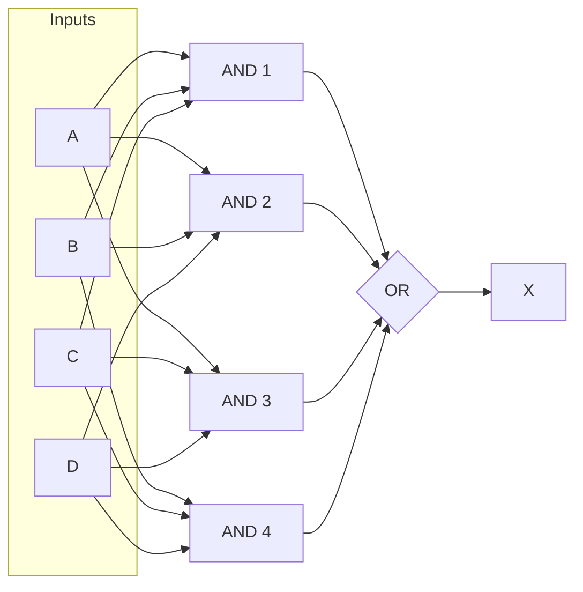

### iii. Construct the logic diagram using OR-AND gate network with simplified POS expression.

### iv. Construct the logic diagram using only NAND gates with simplified SOP expression.

**SOP:** ABD + BCD + ACD + ABC = [ABD + BCD + ACD + ABC]’’ = [(ABD)’(BCD)’(ACD)’(ABC)’]’

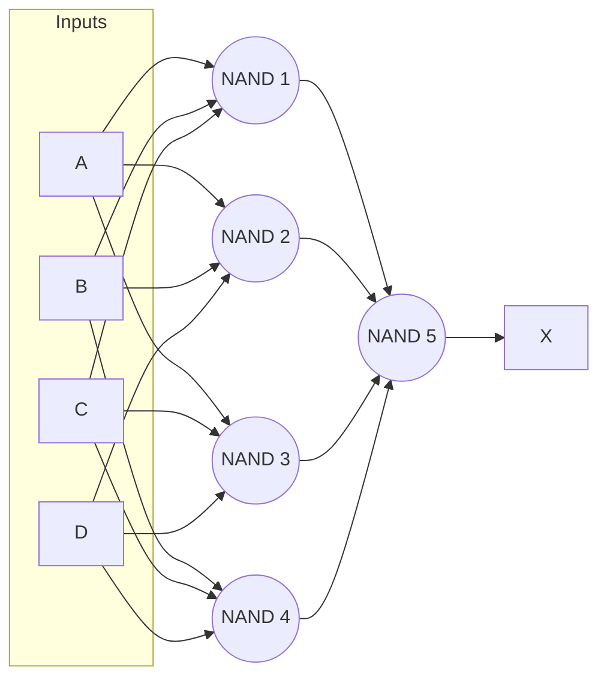

### v. Construct the logic diagram using only NOR gates with simplified POS expression.

**POS:** (A+C)(C+D)(A+B)(A+D)(B+D) = [(A+C)(C+D)(A+B)(A+D)(B+D)]’’ = [(A+C)’ + (C+D)’ + (A+B)’ + (A+D)’ + (B+D)’]’

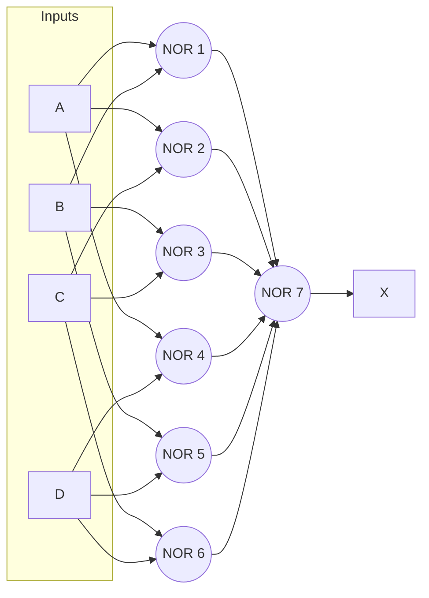

## 3. Design a combinational logic circuit that controls an elevator door in a three-storey building. There are 4 input conditions. M is a logic signal that indicates when the elevator is moving (M=1) or stopped (M=0). F1, F2 and F3 are floor indicator signals that are normally LOW, and they go HIGH only when the elevator is positioned at the level of that particular floor.

### i. Construct the truth table and simplify the Boolean expression into SOP form using K-map with don’t care conditions.

|   M   |   F1   |   F2   |   F3   |   X   |   Product           |   Sum        |
|-------|--------|--------|--------|-------|---------------------|--------------|
|   0   |   0    |   0    |   0    |   0   |                     |   A+B+C+D    |
|   0   |   0    |   0    |   1    |   1   |   M’(F1)’(F2)’(F3)  |   A+B+C+D’   |
|   0   |   0    |   1    |   0    |   1   |   M’(F1)’(F2)(F3)’  |   A+B+C’+D   |
|   0   |   0    |   1    |   1    |   X   |                     |   A+B+C’+D’  |
|   0   |   1    |   0    |   0    |   1   |   M’(F1)(F2)’(F3)’  |   A+B’+C+D   |
|   0   |   1    |   0    |   1    |   X   |                     |   A+B’+C+D’  |
|   0   |   1    |   1    |   0    |   X   |                     |   A+B’+C’+D  |
|   0   |   1    |   1    |   1    |   X   |                     |              |
|   1   |   0    |   0    |   0    |   0   |                     |   A’+B+C+D   |
|   1   |   0    |   0    |   1    |   0   |                     |   A’+B+C+D’  |
|   1   |   0    |   1    |   0    |   0   |                     |   A’+B+C’+D  |
|   1   |   0    |   1    |   1    |   X   |                     |              |
|   1   |   1    |   0    |   0    |   0   |                     | A’+B’+C+D    |
|   1   |   1    |   0    |   1    |   X   |                     |              |
|   1   |   1    |   1    |   0    |   X   |                     |              |
|  1    |   1    |   1    |   1    |   X   |                     |              |

**SOP:** M’(F1)+M’(F2)+M’(F3)

### ii. Construct the logic diagram using AND-OR gate network with simplified SOP expression.

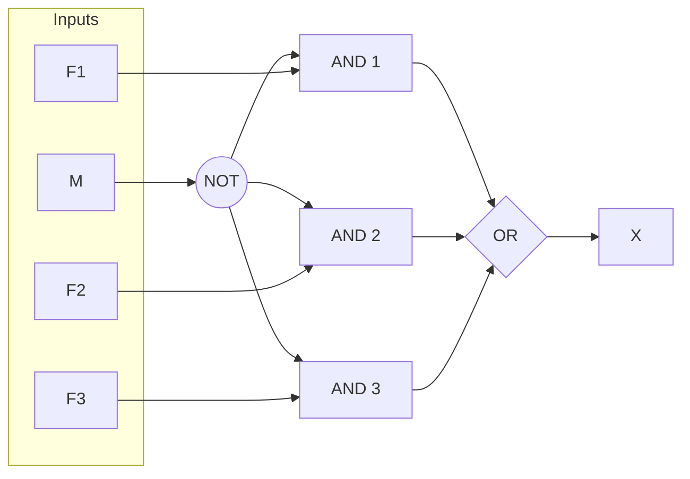

### iii. Construct the logic diagram using only NAND gates with simplified SOP expression

M’(F1)+M’(F2)+M’(F3) = [M’(F1)+M’(F2)+M’(F3)]’’ = [{M’(F1)}’{M’(F2)}’{M’(F3)}’]’

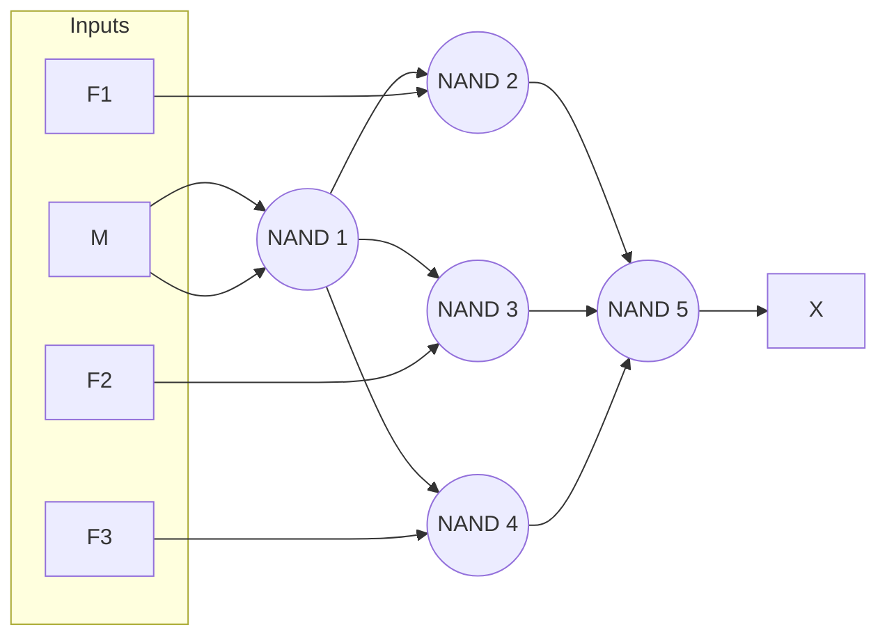

## 4. Design a minimal combinational logic circuit that detects the presence of any of the six illegal code groups in the 8421 standard BCD code by providing a logic-1 output.

### i. Construct the truth table and simplify the Boolean expression using K-map.

|   A   |   B   |   C   |   D   |   X   |   Product  |
|-------|-------|-------|-------|-------|------------|
|   0   |   0   |   0   |   0   |   0   |            |
|   0   |   0   |   0   |   1   |   0   |            |
|   0   |   0   |   1   |   0   |   0   |            |
|   0   |   0   |   1   |   1   |   0   |            |
|   0   | 1     |     0 |   0   |     0 |            |
|   0   |   1   |   0   |   1   |   0   |            |
|   0   |   1   |   1   |   0   |   0   |            |
|   0   |   1   |   1   |   1   |   0   |            |
|   1   |   0   |   0   |   0   |   0   |            |
|   1   |   0   |   0   |   1   |   0   |            |
|   1   |   0   |   1   |   0   |   1   |   AB’CD’   |
|   1   |   0   |   1   |   1   |   1   |   AB’CD    |
|   1   |   1   |   0   |   0   |   1   |   ABC’D’   |
|   1   |   1   |   0   |   1   |   1   |   ABC’D    |
|   1   |   1   |   1   |   0   |   1   |   ABCD’    |
|   1   |   1   |   1   |   1   |   1   |   ABCD     |

**SOP:** AB + AC

### ii. Construct the logic diagram using basic logic gates that produces minimum hardware requirement.

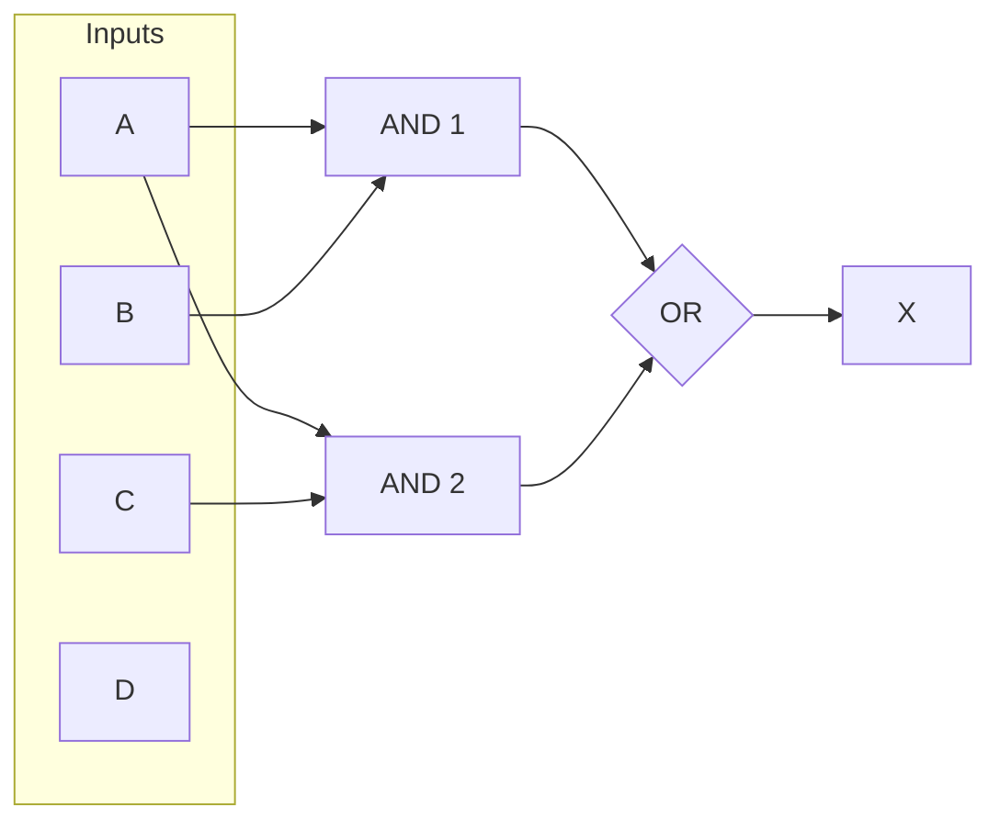

## 5. A combinational logic circuit has four inputs and one output. The output is 1 if and only if the decimal number represented by the inputs in binary code is a prime number.

### i. Construct the truth table and simplify the Boolean expression into POS form using K- map.

|   A   |   B   |   C   |   D   |   X   |   Sum          |
|-------|-------|-------|-------|-------|----------------|
|   0   |   0   |   0   |   0   |   0   |   A+B+C+D      |
|   0   |   0   |   0   |   1   |   0   |   A+B+C+D’     |
|   0   |   0   |   1   |   0   |   1   |                |
|   0   |   0   |   1   |   1   |   1   |                |
|   0   |   1   |   0   |   0   |   0   |   A+B’+C+D     |
|   0   |   1   |   0   |   1   |   1   |                |
|   0   |   1   |   1   |   0   |   0   |   A+B’+C’+D    |
|   0   |   1   |   1   |   1   |   1   |                |
|   1   |   0   |   0   |   0   |   0   |   A’+B+C+D     |
|   1   |   0   |   0   |   1   |   0   |   A’+B+C+D’    |
|   1   |   0   |   1   |   0   |   0   |   A’+B+C'+D    |
|   1   |   0   |   1   |   1   |   1   |                |
|   1   |   1   |   0   |   0   |   0   |   A’+B’+C+D    |
|   1   |   1   |   0   |   1   |   1   |                |
|   1   |   1   |   1   |   0   |   0   |   A’+B’+C’+D   |
|   1   |   1   |   1   |   1   |   0   |   A’+B’+C’+D’  |

**POS:** (B+C)(B’+D)(A’+D)(A’+B’+C’)

### ii. Construct the logic diagram using OR-AND gate network with simplified POS expression

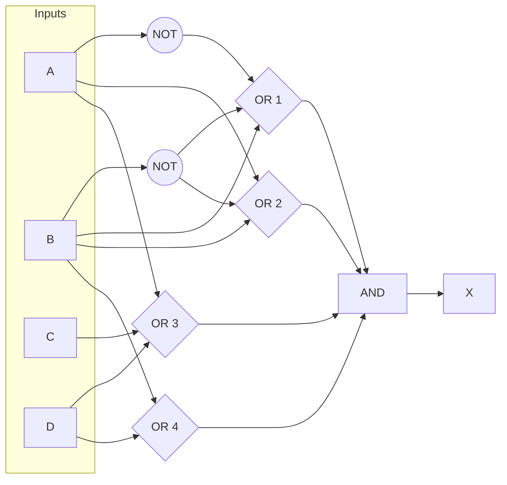

### iii. Construct the logic diagram using only NOR gates with simplified POS expression.

(B+C)(B’+D)(A’+D)(A’+B’+C’) = [(B+C)(B’+D)(A’+D)(A’+B’+C’)]’’ = [(B+C)’ + (B’+D)’ + (A’+D)’ + (A’+B’+C’)’]’

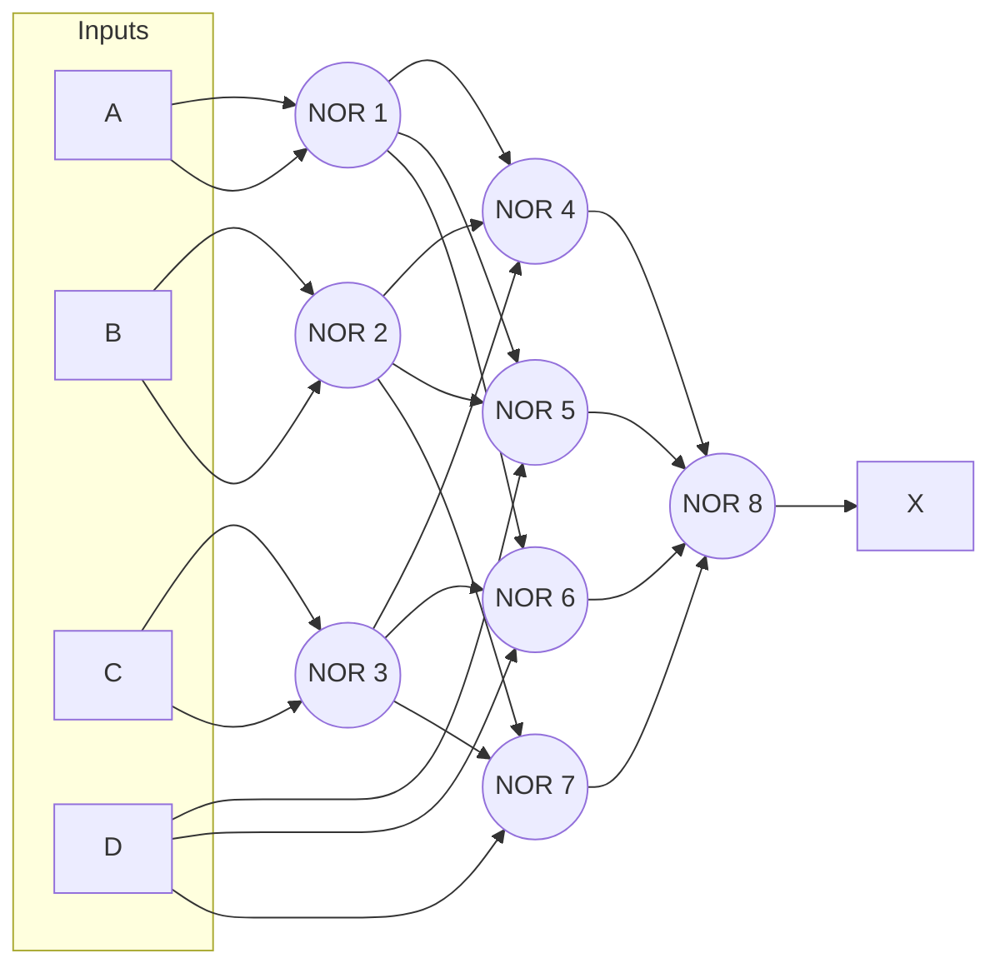
